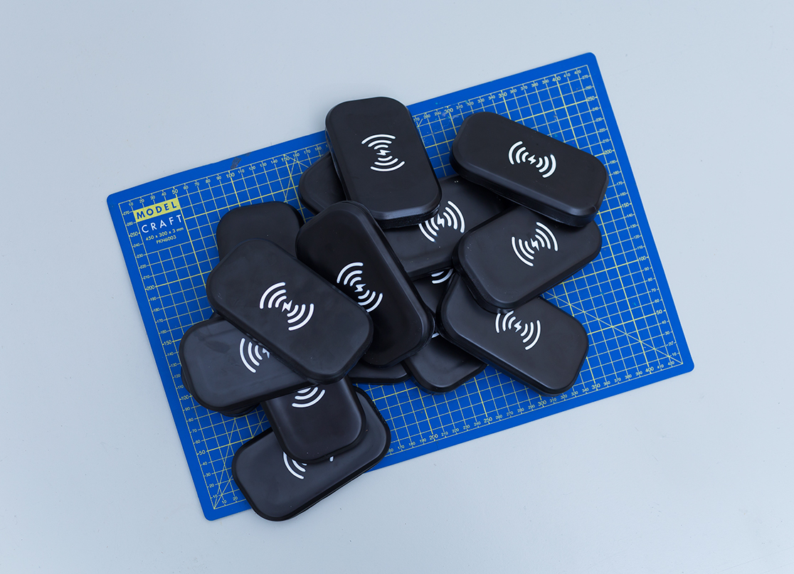

# Opencoil

Goodies to produce your own e-scooter add-ons.

* CNC: an outline to cnc/lasercut to mount various hardware to charging pads
* Code: example code + instructions
* Coil: what coils do you need to harness the power of wireless energy in the wild?
* Electronics: schematics, kicad files to make your own pcb + wiring instructions
* Mold: a 3d model of the actual charging pad, to thermoform your own replicas.

https://opencoil.show/ 
